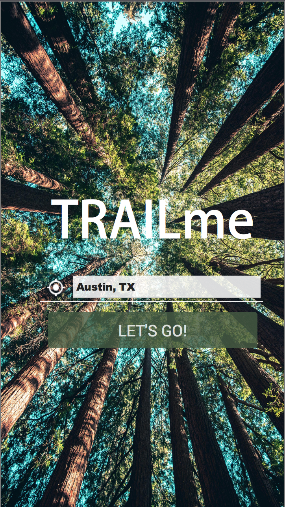
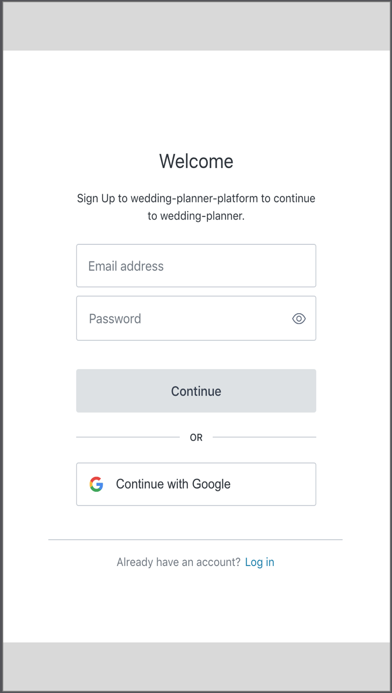
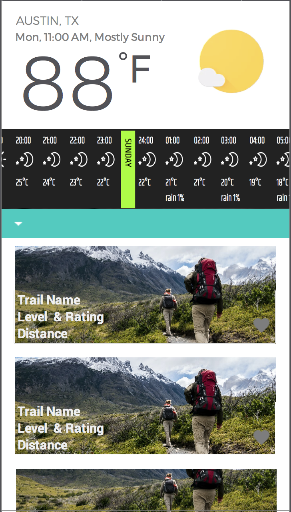
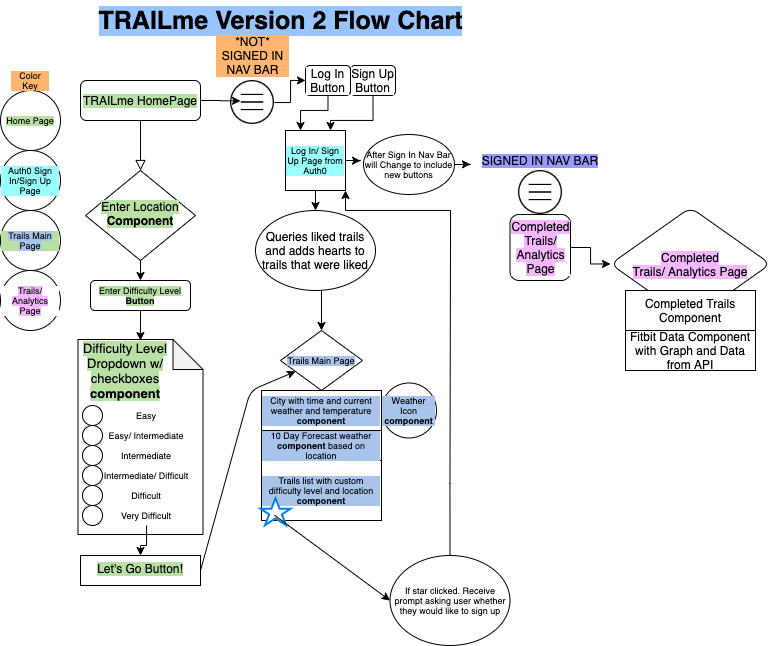

# TRAILme-App Version 2 MERN STACK

### Table of Contents

- [Application MVP](#application-mvp)
- [User Stories](#user-stories)
- [Wire Frames](#wire-frames)
- [Flow Charts](#flow-chart)
- [Project Description](#project-description)
- [Technology Used](#technology-used)
- [Core Node Dependencies](#core-node-depencencies)
- [Reference Links](#reference-links)
- [APIs Used](#api-list)
- [ER Diagram](#api-list)

---

## Application MVP

To make a web app that uses Hiking Project API to gather hiking trails near you. We will have a login page so you can make a user and store your previously favorited trails. We will also have analytics to see progress along certain trails and displayed in the graphs.

- The user can see hiking trails near there current location or chosen zip code.
- The user can find hiking trails based on a particular difficulty level.
- The user can login to a personal portal to view previous liked trails and see graph data for various aspects of their trail run.
- The user can see pictures of the trails near them or a specific zip code.
- The user can see a 10 day forecast for the area selected.

---

## User Stories

```
AS a person who is looking for a hiking trail
I WANT to be able to see the nearest trail to my location also with my skill level
SO THAT I can find a hiking trail that suites my needs
```

---

## Wire Frames

  

---

## Flow Chart



---

## Project Description

TRAILme features is a web app will show hiking trails and information near the user using hiking project API. They will be able to log in to a personal portal where they can view analytics from their run and previously favorited trails.

---

## Technology Used

- Create-React-App
- React.js
- CSS
- HTML
- Javascript
- React Bootstrap-
- Node.js
- Auth0
- MongoDB
- Mongoose
- Heroku

---

## API List

| Provider       |
| -------------- |
| Hiking Project |
| OpenWeather    |
| Fitbit         |
| Google Maps    |

---

## Core Node Dependencies

- Create-React-App using `npx create-react-app my-app`
- @auth0/auth0-react using `npm i @auth0/auth0-react`
  --more NPM packages will be defined and explained here--

---

## Reference Links

Link to TrailMe App deployed on Heroku - [TRAILme App Live Link](https://---.herokuapp.com/)

Link to GitHub Repo used for application development - [TRAILme App GitHub Repo](https://github.com/TRAILme-APP/TRAILme)

Link to Project Board used for application development - [Project Board](https://github.com/TRAILme-APP/TRAILme/projects/2)

---

## ER Diagram


--

## Future Development

--to be done when deadline is met--
